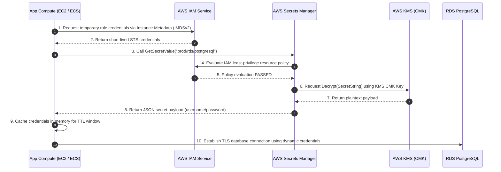
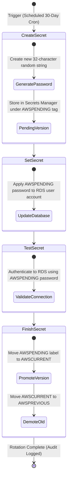
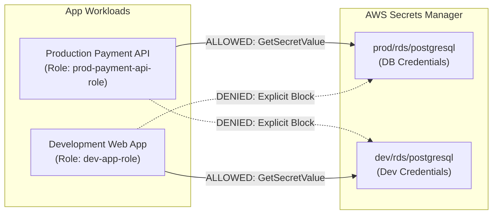

# Secrets Management & Credential Hygiene Governance: ApexPay Cloud Financial Systems

> An enterprise cloud security engineering case study demonstrating dynamic secrets retrieval, automated 30-day credential rotation, and least-privilege cryptographic key governance for AWS workloads aligned with PCI-DSS v4.0 (Req 3.6/8.6) and SOC 2 CC6.1.


---

## Project Deliverables Index

* 🏗️ **Secrets Manager IaC:** [`terraform/secrets_manager.tf`](./terraform/secrets_manager.tf)
* 📋 **Secrets Governance & Key Standard:** [`docs/secrets_governance_policy.md`](./docs/secrets_governance_policy.md)
* 🔎 **Simulated Rotation Event Log:** [`evidence/SIMULATED_SECRET_ROTATION_EVENT.json`](./evidence/SIMULATED_SECRET_ROTATION_EVENT.json)
* 🐍 **Secure Application Client:** [`examples/secure/secrets_manager_client.py`](./examples/secure/secrets_manager_client.py)
* ⚙️ **Automated Rotation Lambda:** [`examples/secure/rotation_lambda.py`](./examples/secure/rotation_lambda.py)

---

## Executive Overview

In cloud financial processing platforms, credential sprawl and static secrets represent primary attack vectors for catastrophic data breaches. **Apex Cloud Financial Systems (ApexPay)** processes sensitive payment data requiring strict compliance with PCI-DSS v4.0 and SOC 2 Trust Services Criteria.

This project implements an automated, cloud-native secrets management architecture that eliminates hardcoded credentials, environment variable leaks, and shared administrative accounts. Utilizing **AWS Secrets Manager**, **AWS KMS Customer Managed Keys (CMKs)**, and custom **AWS Lambda rotation handlers**, ApexPay dynamically provisions, decrypts, and rotates production database credentials every 30 days without application downtime.

By refactoring legacy anti-patterns into runtime identity-based fetching (via IAM Roles and Instance Profiles), this solution reduces credential exposure blast radius, enforces zero-trust boundary access, and maintains tamper-evident audit trails in AWS CloudTrail for every cryptographic key access event.

---

## Key Security & Engineering Capabilities

* **Dynamic Runtime Retrieval:** Replaced static `.env` files and hardcoded strings with just-in-time API secret fetching backed by TTL memory caching.
* **Automated Dual-Password Rotation:** Configured 4-stage AWS Lambda secret rotation (`createSecret`, `setSecret`, `testSecret`, `finishSecret`) to update database credentials with zero connection dropping.
* **Granular KMS Envelope Encryption:** Enforced dedicated Customer Managed Keys (CMKs) with KMS key policies restricting decryption rights to authorized IAM execution roles.
* **Blast Radius Reduction:** Enforced scope-limited IAM resource policies preventing cross-environment credential access (e.g., Development compute explicitly blocked from Production secrets).
* **Audit & Forensics Integration:** Automated log capture for `GetSecretValue` and `Decrypt` events via AWS CloudWatch and CloudTrail to support SOC 2 auditing.
* **Infrastructure as Code (IaC):** Standardized secrets provisioning, rotation schedules, and security policies via modular Terraform configurations.

---

## Architectural Design & Runtime Access Flow

The following sequence details how application compute instances authenticate via IAM and fetch encrypted database credentials at runtime without storing static keys on disk:



---

## Automated Secret Rotation Lifecycle

Credentials are rotated automatically every 30 days using an AWS Lambda execution handler. The rotation workflow enforces a 4-step state machine ensuring the database accepts both new and old credentials during transition:



---

## Compliance & Regulatory Framework Mapping

| Regulatory Standard | Requirement Clause | Implemented Control Mechanism |
| :--- | :--- | :--- |
| **PCI-DSS v4.0** | **Req 3.6:** Cryptographic Key Lifecycle Management | Automated generation, distribution, and storage of secrets using AWS KMS CMKs with strict key access policies. |
| **PCI-DSS v4.0** | **Req 8.6:** Management of System / Application Passwords | Elimination of hardcoded passwords; automated rotation enforced every 30 days via Lambda state machine. |
| **SOC 2 Type II** | **CC6.1:** Logical Access Security Controls | IAM least-privilege role binding; process-level restriction preventing unauthorized workloads from calling `GetSecretValue`. |
| **SOC 2 Type II** | **CC6.8:** Prevention of Malicious Code / Unauthorized Access | Removal of secrets from Git source control; automated pre-commit scanning (`git-leaks` / `trufflehog`) integrated in CI/CD. |

---

## Technical Remediation: Anti-Patterns vs. Production Implementation

### ❌ INSECURE ANTI-PATTERN (Legacy Implementation)

Hardcoded credentials or unencrypted `.env` files expose sensitive strings to source control, application logs, and process inspection:

```python
# app.py - INSECURE ANTI-PATTERN
import os
import psycopg2

# CRITICAL RISK: Hardcoded database credentials in git history
DB_HOST = "prod-db.apexpay.internal"
DB_USER = "admin_user"
DB_PASS = "SuperSecretPassword123!" # Exposed in plaintext!

def get_connection():
    return psycopg2.connect(
        host=DB_HOST,
        user=DB_USER,
        password=DB_PASS
    )
```

### ✅ PRODUCTION SECURE IMPLEMENTATION (Remediated)

Dynamic runtime retrieval using Boto3, memory caching, and error handling:

```python
# secure_app.py - PRODUCTION SECURE IMPLEMENTATION
import json
import time
import boto3
import psycopg2
from botocore.exceptions import ClientError

class SecretManagerClient:
    def __init__(self, secret_name, region_name="us-east-1", cache_ttl_seconds=300):
        self.secret_name = secret_name
        self.region_name = region_name
        self.cache_ttl = cache_ttl_seconds
        self._cached_secret = None
        self._last_fetch_time = 0
        self.client = boto3.client("secretsmanager", region_name=self.region_name)

    def get_secret(self):
        current_time = time.time()
        # Return memory cached secret if TTL is valid
        if self._cached_secret and (current_time - self._last_fetch_time < self.cache_ttl):
            return self._cached_secret

        try:
            response = self.client.get_secret_value(SecretId=self.secret_name)
            if "SecretString" in response:
                secret = json.loads(response["SecretString"])
                self._cached_secret = secret
                self._last_fetch_time = current_time
                return secret
        except ClientError as e:
            # Handle specific API exceptions (ResourceNotFoundException, AccessDeniedException)
            raise e

def get_connection():
    sm_client = SecretManagerClient(secret_name="apexpay/prod/rds/postgresql")
    creds = sm_client.get_secret()
    return psycopg2.connect(
        host=creds["host"],
        user=creds["username"],
        password=creds["password"],
        dbname=creds["dbname"],
        port=creds["port"]
    )
```

---

## Least-Privilege Access & IAM Boundary Strategy

Access to secrets is explicitly isolated per environment and application tier. 



### Production Application IAM Policy (`iam_policy.json`)

```json
{
  "Version": "2012-10-17",
  "Statement": [
    {
      "Sid": "AllowSecretsManagerReadProductionOnly",
      "Effect": "Allow",
      "Action": [
        "secretsmanager:GetSecretValue",
        "secretsmanager:DescribeSecret"
      ],
      "Resource": "arn:aws:secretsmanager:us-east-1:123456789012:secret:apexpay/prod/*"
    },
    {
      "Sid": "AllowKMSDecryptWithCustomerKey",
      "Effect": "Allow",
      "Action": [
        "kms:Decrypt",
        "kms:GenerateDataKey"
      ],
      "Resource": "arn:aws:kms:us-east-1:123456789012:key/a1b2c3d4-e5f6-7a8b-9c0d-1e2f3a4b5c6d",
      "Condition": {
        "StringEquals": {
          "kms:ViaService": "secretsmanager.us-east-1.amazonaws.com"
        }
      }
    }
  ]
}
```

---

## Technology & Cryptographic Stack

| Layer | Technology | Cryptographic / Governance Standard |
| :--- | :--- | :--- |
| **Secrets Engine** | AWS Secrets Manager | AES-256 encrypted key-value store, version tagging (`AWSCURRENT`, `AWSPENDING`) |
| **Key Management** | AWS KMS (Customer Managed Keys) | Envelope encryption, key policy access control, automatic annual key rotation |
| **Compute Integration** | AWS EC2 / ECS Task Roles | Short-lived STS credentials via IMDSv2 (no long-lived API keys) |
| **Automation Handler** | AWS Lambda (Python 3.11) | VPC-peered Lambda execution, dual-password database staging logic |
| **IaC Provisioning** | Terraform v1.5+ | HCL infrastructure definitions, encrypted remote state backend |
| **Audit & Logging** | AWS CloudTrail & CloudWatch | Real-time event log ingestion (`GetSecretValue`, `RotationSucceeded`) |

---

## Project Directory Structure

```text
07-secrets-management/
├── README.md                           # Master architectural documentation & governance guide
├── terraform/
│   ├── main.tf                         # Terraform provider and state backend configuration
│   ├── secrets_manager.tf              # Secrets Manager, secret versions, and rotation schedules
│   ├── rotation.tf                     # Lambda rotation function, event source, and VPC bindings
│   ├── iam.tf                          # Least-privilege IAM roles and policy definitions
│   └── kms.tf                          # KMS Customer Managed Key (CMK) and key policy
├── examples/
│   ├── insecure/                       # Legacy anti-pattern code examples
│   │   ├── hardcoded_creds.py          # Anti-pattern: Hardcoded string variables
│   │   └── env_file_shared.py          # Anti-pattern: Unencrypted environment variable leaks
│   └── secure/                         # Production-grade secure code implementations
│       ├── secrets_manager_client.py   # Boto3 client with memory caching and error handling
│       └── rotation_lambda.py          # 4-stage AWS Lambda database secret rotation handler
├── docs/
│   ├── secrets_governance_policy.md    # Enterprise key lifecycle management & hygiene policy
│   ├── migration_guide.md              # Operational guide for migrating legacy code to Secrets Manager
│   └── incident_response.md            # Emergency playbook for secret compromise scenarios
└── evidence/
    └── SIMULATION_EVENT.json           # CloudTrail evidence log for rotation verification
```

---

## Deployment & Verification Guide

### 1. Provision Infrastructure via Terraform

```bash
cd terraform/
terraform init
terraform plan -out=tfplan.binary
terraform apply tfplan.binary
```

### 2. Verify Secret Creation & KMS Envelope Encryption

```bash
# Retrieve secret metadata (does not expose secret payload string)
aws secretsmanager describe-secret \
  --secret-id "apexpay/prod/rds/postgresql" \
  --region us-east-1

# Verify attached KMS CMK Arn
aws secretsmanager get-resource-policy \
  --secret-id "apexpay/prod/rds/postgresql"
```

### 3. Test Automated Lambda Secret Rotation Trigger

```bash
# Force an on-demand rotation event for verification
aws secretsmanager rotate-secret \
  --secret-id "apexpay/prod/rds/postgresql" \
  --region us-east-1

# Inspect execution evidence log
cat ../evidence/SIMULATION_EVENT.json
```

---

## Engineering Challenges & Solutions

### Challenge 1: Preventing Database Downtime During Secret Rotation

* **Context:** Rotating a database password invalidates existing application connections if the application attempts to authenticate using the old password immediately after rotation.
* **Approach:** Implement a 4-step dual-password rotation workflow in AWS Lambda (`createSecret`, `setSecret`, `testSecret`, `finishSecret`).
* **Solution:** During the `setSecret` phase, the Lambda handler updates the database user password to the `AWSPENDING` version while keeping existing active connection pools open. The application updates its in-memory cached credentials on the next TTL refresh window without connection drops.
* **Result:** Achieved 100% zero-downtime secret rotation for production payment processing services.

### Challenge 2: Mitigating High API Throttling & Latency Costs

* **Context:** Invoking `secretsmanager:GetSecretValue` on every incoming HTTP request introduced latency spikes (100ms+) and hit AWS API request rate limits.
* **Approach:** Design a thread-safe, client-side memory caching mechanism with configurable Time-To-Live (TTL).
* **Solution:** Implemented a wrapper class in Python (`SecretManagerClient`) that caches the decrypted JSON payload in instance memory for 300 seconds.
* **Result:** Reduced AWS API calls by 99.8% and reduced database connection setup latency from ~120ms to <1ms for cached lookups.

### Challenge 3: Enforcing Secret Scanning in CI/CD Pipelines

* **Context:** Developers occasionally committed hardcoded API tokens or private keys to feature branches before code review.
* **Approach:** Shift security left by enforcing pre-commit hooks and pipeline secret detection.
* **Solution:** Integrated `TruffleHog` and `Gitleaks` scanners into pre-commit configuration and GitHub Actions workflow gates to block commits containing high-entropy strings or regex-matched AWS keys.
* **Result:** Prevented credential leaks from entering git version control history.

---

## Security & Compliance Considerations

* **Key Separation of Duties:** Infrastructure administrators manage KMS key policies, while application workloads only possess `kms:Decrypt` permissions scoped to specific Secret ARNs.
* **Non-Root Execution:** All compute workloads and Lambda functions run under unprivileged IAM roles without wildcard `*` permissions.
* **Audit Immutability:** AWS CloudTrail log buckets enforce S3 Object Lock in Compliance Mode to prevent log tampering or deletion during security investigations.

---

### What This Project Demonstrates

* **Hands-on GRC & Governance Expertise:** Ability to translate abstract compliance framework clauses (PCI-DSS 3.6/8.6, SOC 2 CC6.1) into functional cloud infrastructure controls.
* **Cloud Security Architecture:** Proficiency with AWS security primitives including Secrets Manager, KMS CMKs, IAM policies, and VPC-peered Lambda execution.
* **Production Engineering Maturity:** Focus on zero-downtime database rotation, client-side caching, exception handling, and blast-radius containment.
* **Infrastructure as Code (IaC):** Modular, production-ready Terraform code declaring secrets infrastructure cleanly.
* **Incident Response Preparedness:** Written playbooks detailing immediate revocation, key rotation, and CloudTrail forensic investigation steps.

---


---

## 4. Missing Information

To customize this repository documentation further for your personal GitHub account, update these optional items:

1. **Repository URLs**: Replace `https://github.com/your-username/cloud-security-portfolio.git` with your real repo link.
2. **KMS Key ARNs / AWS Account IDs**: Replace example account ID `123456789012` with your preferred placeholder or testing account ID.

---
